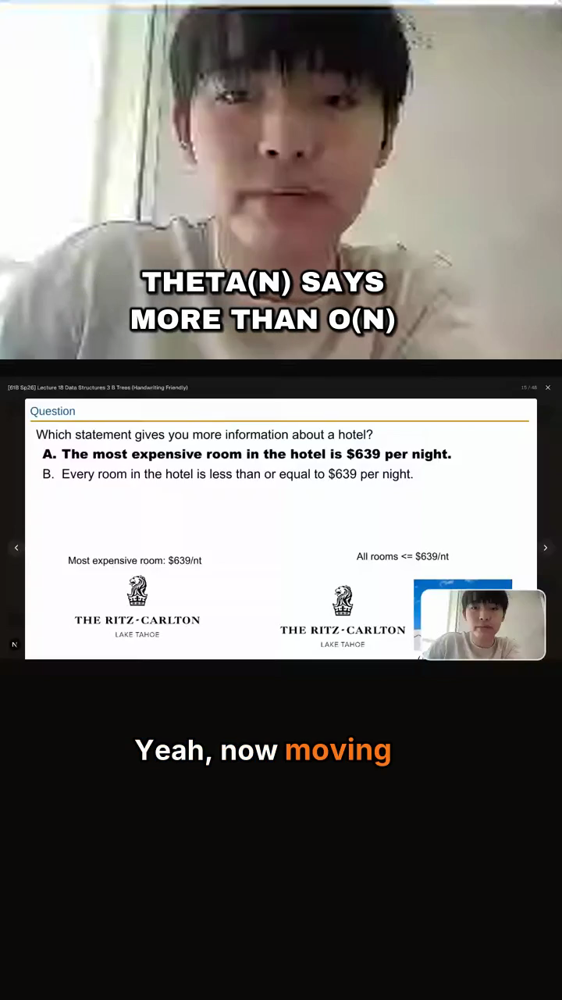
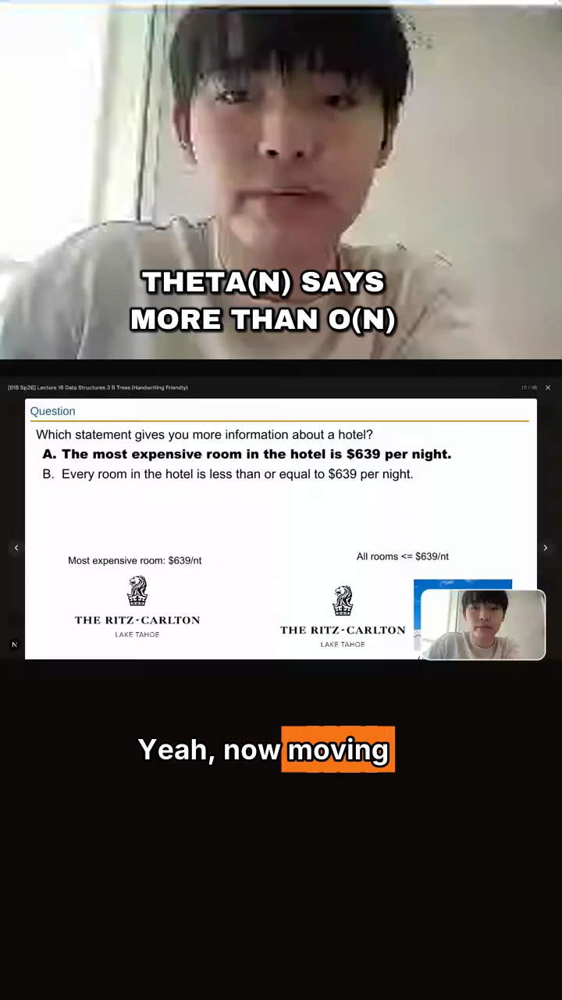
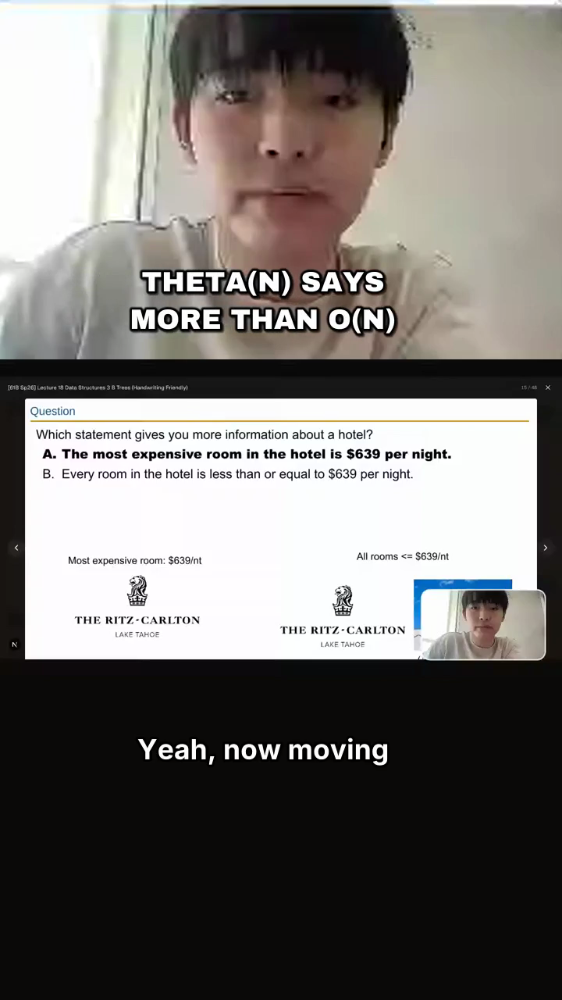
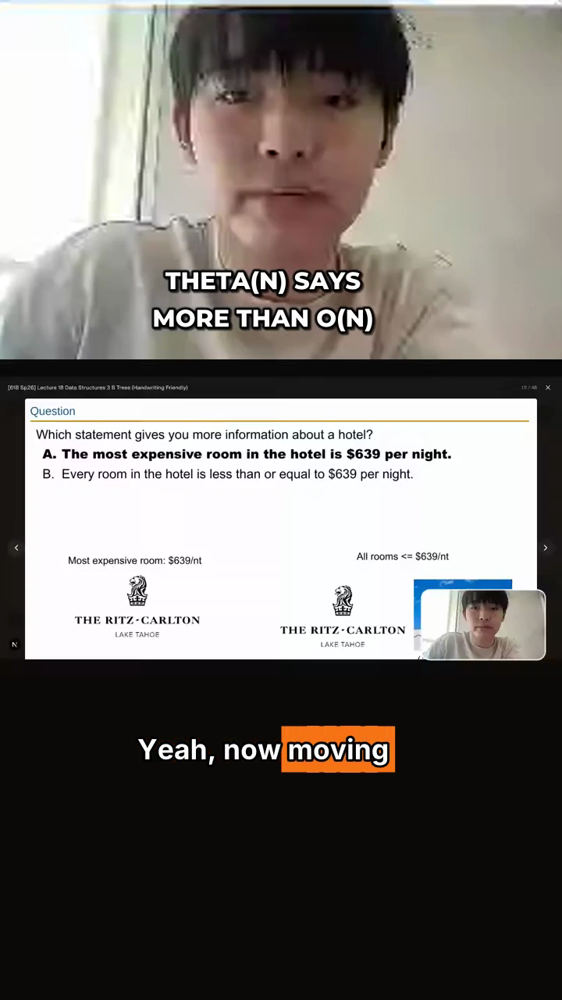
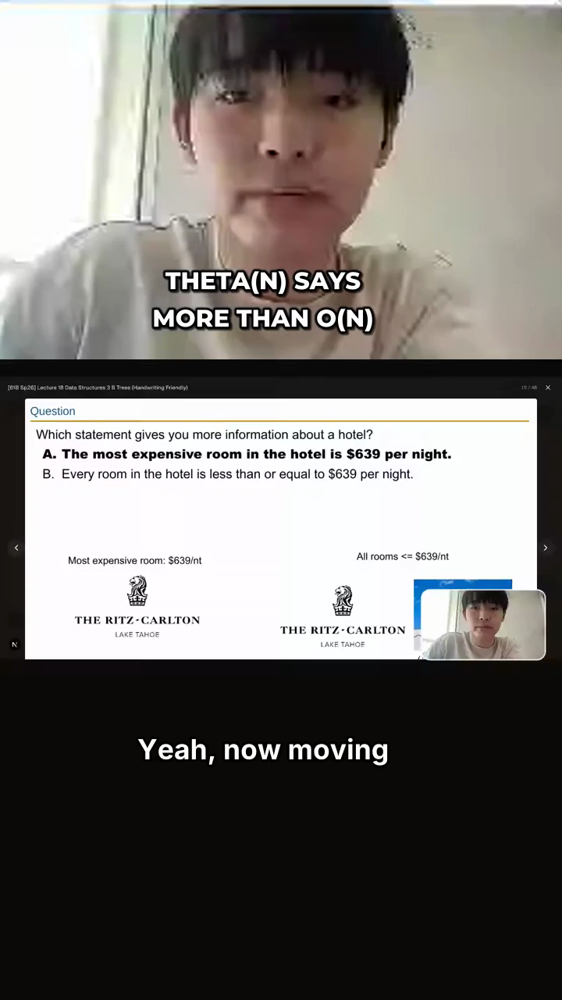

# Clip text bake-off (T-5) — comparison sheet + recorded decision

One-time typography bake-off for the burned hook overlay + karaoke captions
(directive H-1..H-6 + typography addendum T-1..T-7). Every frame below is a
REAL burn (FFmpeg/libass through `render/burn.ts`) over the real Theta(N)
moment from the CS61B asymptotics lesson (`artifacts/m-c-in1-stacked-split.mp4`,
candidate `b0c13ecb`, span 208.9s–258.9s), frame at t=1.6s where both layers
are visible. Regenerate by re-running the procedure documented at the bottom.

## The matrix (2 hook fonts × 3 caption presets)

| Hook font | beam | block | minimal |
|---|---|---|---|
| **Archivo Black** |  |  |  |
| **Montserrat ExtraBold** |  |  |  |

(The caption row is identical across hook fonts — captions are always Inter
Bold; the caption preset varies the ACTIVE-word treatment: beam = brand fill
+ 1.06× scale · block = brand box · minimal = none.)

## Decision (recorded per T-5)

- **Hooks: Archivo Black.** The heavier, more condensed caps carry more
  scroll-stopping presence at 92/72px than Montserrat ExtraBold's rounder,
  airier letterforms — closer to the Submagic/CapCut-class reference look
  (bold geometric caps, hard black stroke, soft drop). Montserrat ExtraBold
  stays bundled (`CLIP_TEXT_FONTS.hookAlt`) as the recorded alternate; the
  swap is a one-line change in `lib/marketing/clips/textStyles.ts`
  (`fonts.hook`) plus a golden regeneration.
- **Captions: Inter Bold, `beam` default.** The brand-orange fill + subtle
  1.06× scale on the spoken word is the clean modern standard and stays
  legible over slides, faces, and code (the non-optional 4px stroke does the
  real work). `block` is the bolder "creator" look, selectable per clip;
  `minimal` is the bofu_preview / academic default (T-3/H-5).
- Reference framing: compared against the published Submagic- and
  CapCut-class caption look (bold sans, black stroke, brand-colored active
  word, lower-third placement). Third-party screenshots aren't committed to
  the repo (redistribution); the criteria they set are: ≥60px caption size at
  1080×1920, non-optional stroke, one line at a time, word-level fill timing —
  all pinned in `CLIP_TEXT_STYLES` and enforced by tests.

Changing any of these values = bump `CLIP_TEXT_STYLE_VERSION` and regenerate
both golden sets in the same PR (`CLIP_TEXT_GOLDENS_RECORD=1 npm run
verify:clips && CLIP_TEXT_GOLDENS_RECORD=1 npm run verify:clips:render`) —
the diff makes the restyle reviewable.

## Reproduction procedure

1. Fetch the lesson transcript words for the span (lesson_transcript,
   lesson `430b5129…`, span 208 872–258 887 ms, shifted clip-relative).
2. `buildClipTextTrack` with preset `tofu_hook`, hook "Theta(N) says more
   than O(N)", `slide_in_fade`, each caption style; for the Montserrat
   variant swap the `WiseHook` style's Fontname in the generated ASS.
3. `buildBurnArgs` → ffmpeg-static over the artifact; extract t=1.6s frames.

The shipped demo artifact from the same procedure (chosen defaults:
Archivo Black + slide_in_fade + beam) is
`artifacts/h-theta-hook-burn-demo.mp4`.
